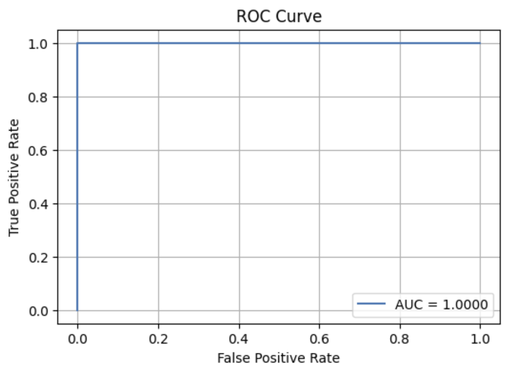

# ML4SCI GSoC 2025 Evaluation – Vision Transformer for Data Quality Monitoring

This repository contains my submission for the **Machine Learning for Science (ML4SCI)** Google Summer of Code 2025 evaluation task, under the project **ML4DQM**.

The goal of this task was to develop a machine learning model using a **Vision Transformer (ViT)** architecture to classify synthetic DigiOccupancy image data from the LHC's CMS detector into their respective dataset runs.

---

## 🚀 Project Overview

**Task**:  
Classify whether a given (64×72) DigiOccupancy image comes from:
- `Run355456_Dataset.npy` → Class 0
- `Run357479_Dataset.npy` → Class 1

**Model**:  
A Vision Transformer (ViT) model implemented using the `timm` PyTorch library.

**Challenge**:  
The data is sensitive to evolving detector conditions, and the model must remain robust to such changes. This evaluation is a precursor to building **continual learning models** for real-time anomaly detection in high-energy physics experiments.

---

## 🧠 Model Architecture

- **Base Model**: `vit_base_patch16_224` from the `timm` library
- **Input Shape**: Padded from (64×72) → (64×76), then resized to (224×224)
- **Channels**: Grayscale (1 channel)
- **Classifier Head**: 2-class softmax

---

## 📦 Dataset

Each `.npy` file contains shape `(10000, 64, 72)`, representing:
- 10,000 LumiSections (LS)
- Each LS is a 2D DigiOccupancy image of HCAL detector hit counts

We combined both datasets into:
- **X** shape: `(20000, 1, 64, 72)`
- **y** shape: `(20000,)` with binary labels

---

## 🔍 Preprocessing

- **Normalization**: Values scaled between 0 and 1
- **Padding**: Zero-padded width to convert (64, 72) → (64, 76)
- **Resizing**: Final input resized to (224, 224) for ViT compatibility

---

## ⚙️ Training Details

| Hyperparameter | Value |
|----------------|-------|
| Epochs         | 5     |
| Batch Size     | 250   |
| Optimizer      | Adam  |
| LR             | 1e-4  |
| Loss           | CrossEntropyLoss |

> Training was run on CPU and Google Colab GPU for evaluation purposes. A smaller subset was used during development for iteration speed.

---

## 📊 Evaluation Results

- **Accuracy**: 1.0000
- **AUC**: 1.0000
- **ROC Curve**: Perfect separation (see figure below)



---

## 📁 Files in This Repo

```
.
├── data/
│   ├── Run355456_Dataset.npy
│   └── Run357479_Dataset.npy
├── notebooks/
│   └── ml4dqm_vit.ipynb
├── outputs/
│   ├── roc_curve.png
├── README.md
└── requirements.txt
```

---

## 📨 Submission Instructions

This project is submitted as part of the **ML4SCI GSoC 2025 evaluation**.  
All required files are submitted as:
- 📋 A PDF export of the notebook
- 🔗 GitHub repo link
- 📄 CV

---

## 🤛 About Me

I'm **Jimi Oso**, an undergraduate EECS student at MIT with a passion for AI, data systems, and real-world machine learning applications. I'm excited about the intersection of physics and ML, and I look forward to contributing to the ML4SCI initiative this summer.

---

## 📢 Contact

Feel free to reach out:  
📧 jimixoso@mit.edu (for ML4SCI reviewers)  
👁️ [GitHub Profile](https://github.com/jimixoso)
```